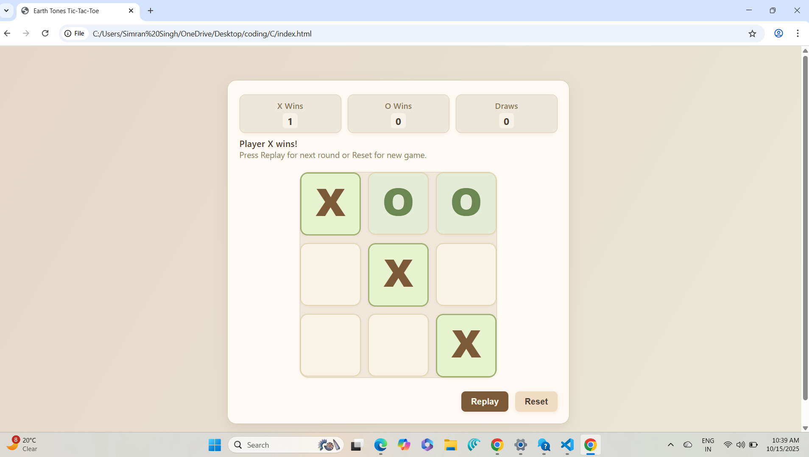

# TJ-Tasks-2025-<Simran_Singh>

## Project: Tic-Tac-Toe Game in HTML/CSS/JS

---

## Task Prompt
Create a single-file, self-contained HTML/CSS/vanilla JS Tic-Tac-Toe game with an earth tones UI. The app should include:

A visually appealing scoreboard showing X Wins, O Wins, and Draws.

A responsive, animated, rounded 3x3 game board styled with soft earth colors (clay brown, olive green, sand).

Real-time status text that shows whose turn it is, plus clear win/draw messages.

Win detection using 8 standard patterns and proper draw handling.

Buttons for Replay (keeps score) and Reset (resets scores).

Keyboard/accessibility friendly: cells must be accessible by tab, with visible focus cues.

No external dependencies; all code is in one HTML file.

UI uses a warm earth tone gradient for background, a soft card container with rounded corners, and subtle shadows.

## Approach and Algorithm

- Initialized a 3x3 array to represent the game board.
- Used alternating state to track which player's turn it is (X or O).
- After each move:
  - Updated board state and UI.
  - Checked all win conditions (rows, columns, diagonals).
  - Determined draw if board is full and no win found.
  - Updated real-time status and scoreboard counts.
- Replay resets only the board; Reset clears all scores.
- Designed a responsive UI with CSS gradients and modern rounded cards.
- Prioritized accessibility (keyboard nav, ARIA, clear focus).

---

## Challenges and Learnings

Ensured the interface was accessible and responsive for all users. Utilizing only vanilla JavaScript required careful event and state management. The project also demonstrates UI best practices and finishing polish using only HTML and CSS. AI tools like Perplexity and ChatGPT were referenced for support and optimization tips.

---

## Screenshots of Final Output

---

## How to Run

- Download or clone this repository.
- Open index.html in any modern browser.
- Play and enjoy!

---

## Technologies Used

- HTML5
- CSS3 (modern gradients and layouts)
- JavaScript (ES6, DOM)
- Accessibility features (ARIA, keyboard navigation)
- AI tools (Perplexity, ChatGPT)

---

## Attached Files

- [prompt.txt](prompt.txt): Assignment requirements

---

Prepared by <Simran Singh> for 2025 task submission.
